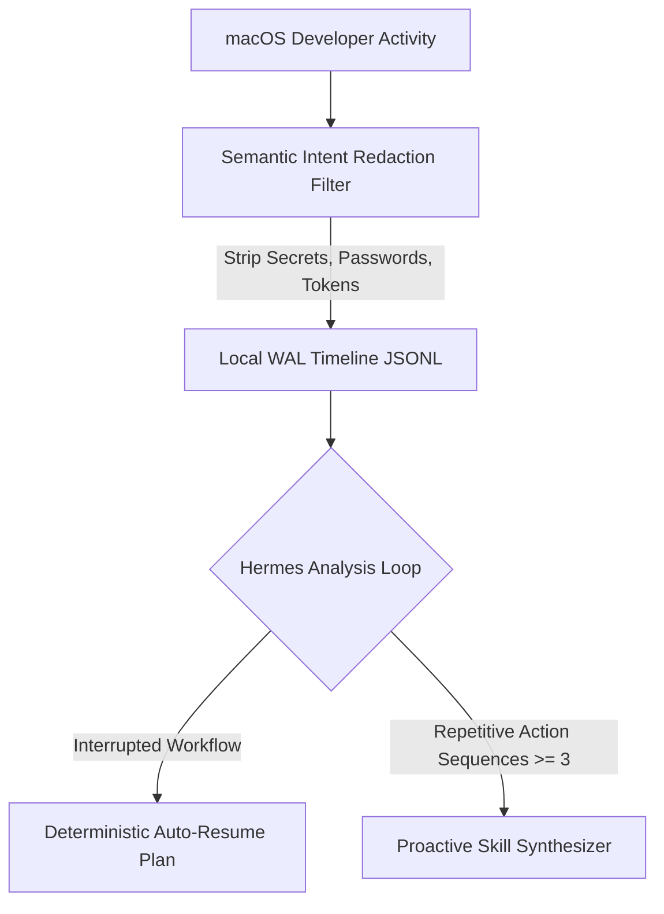

# Hermes Semantic Timeline & Task Continuation Engine

## Purpose & Architecture

Improves upon OpenAI's macOS "Computer History" feature by delivering **100% local, privacy-first workflow tracking and task auto-continuation** without raw keystroke surveillance, cloud fine-tuning leakage, or unencrypted storage risks.



## Core Capabilities

1. **Semantic Event Timeline** (`tools/hermes-timeline-engine.js`):
   - Logs structured workflow events (`git_commit`, `test_run`, `pr_review`, `cli_action`) to local SQLite/JSONL.
   - Zero keystroke logging; automatic scrubbing of bearer tokens, private keys, and API keys.

2. **Incomplete Task Auto-Resume**:
   - Analyzes recent event sequences to isolate started/in-progress tasks that were interrupted.
   - Proposes concrete next-step action plans to complete the work without human babysitting.

3. **Repetitive Workflow Skill Discovery**:
   - Detects repeated manual commands ($\ge 3$ occurrences) and synthesizes suggested repeatable skills.

## Verification Commands

```bash
# Run timeline engine test suite
node tests/test-hermes-timeline-engine.js
```
