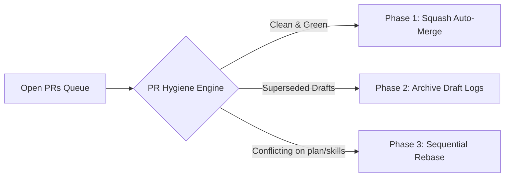

# Multi-Agent PR Hygiene & Triage Engine

## Purpose

Automates the **PR hygiene session pattern (2026-08-17)** from `AGENTS.md`. Classifies all open PRs in the repository into Clean/Mergeable, Conflicting (needs rebase), Superseded Draft Logs, and Dependabot updates.



## Verification Commands

```bash
# Run PR triage audit
node tools/pr-hygiene-engine.js

# Run test suite
node tests/test-pr-hygiene-engine.js
```
