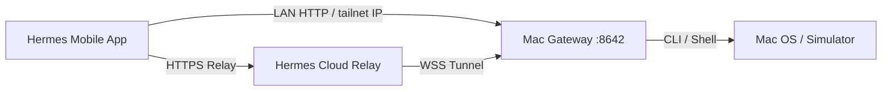

# System Architecture Context Pack

This context pack is designed to be fed into LLM prompts to quickly spin up agent understanding of the `mac-yolo-safeguards` and `hermes-mobile` projects.

---

## 🏛️ System Overview

The system consists of three main components:
1. **Mac Safeguards Daemon:** Shell scripts (`sim-runaway-guard.sh`) and LaunchAgents (`com.igor.shutdown-simulators`) that monitor system load average and active process counts to auto-kill runaway simulators or indexers and keep the Mac stable.
2. **Hermes Mobile Client:** A React Native (Expo) mobile client that communicates with the Mac gateway to send approvals, check health, and run chat operations.
3. **Hermes/Telegram Gateway Daemon:** A python-based local gateway that routes commands and approvals from the mobile client or Telegram bot interface.

---

## 🗺️ Network & Communication Architecture

- **Cloud Relay:** Paired once, routes approvals and commands over the internet securely.
- **Local Wi-Fi Search:** LAN scanning serves as the fallback when direct IP connection is not reachable.
- **Tailscale Failover:** Auto-resolves Tailscale IPs to establish direct network connectivity off-Wi-Fi without routing through external cloud relays.
- **USB Pairing:** Uses ADB reverse forwarding (`tcp:8642` and `tcp:8765`) to tunnel traffic from USB-connected phones directly to the local MacBook port.

---

## 🧪 Current Verification Status
- **Unit Tests:** 100% Green (`npm test -- --no-cache` passes 679 tests).
- **E2E Automation:** Verified `pass` on physical devices via Maestro.
- **Type Checking:** TypeScript check (`npx tsc --noEmit`) passes cleanly with 0 compilation errors.
