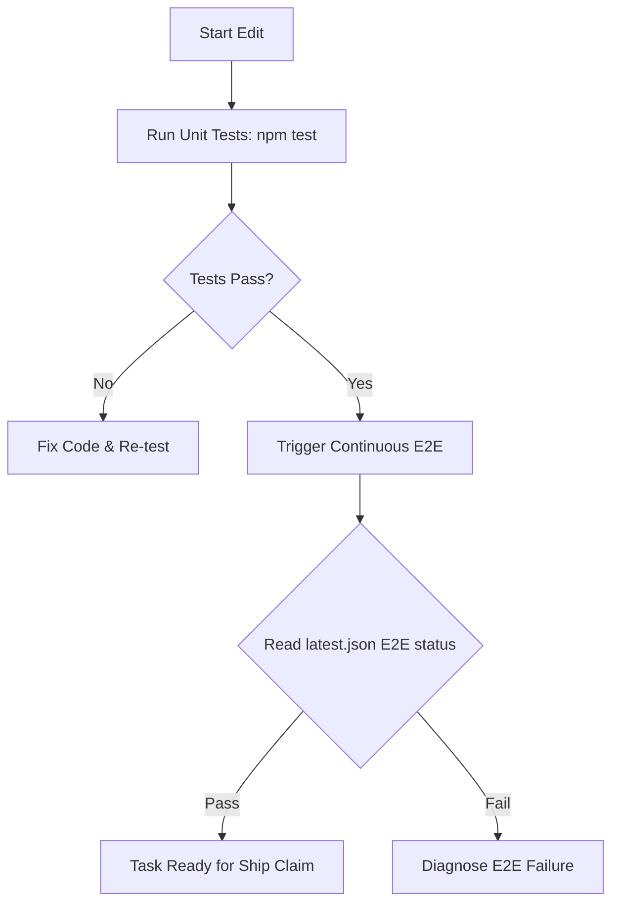

# Release APK Safety & Verification Contract

---

## 📱 Real-User Readiness
Hermes Mobile is a real-user product. All tests must treat the environment as if it is a brand-new user:
- No assumed active ADB reverse tunnels in production.
- No development backdoors enabled by default.
- Release installs must test realistic cellular and Wi-Fi paths.

---

## 🔄 Verification Lifecycle
Every agent modifying `hermes-mobile/` must execute the verification steps sequentially:



### 📋 Checklist & Commands

1. **Session Start Verification:**
   - Execute `node tools/agent-session-start.js` to fetch continuous E2E status.
2. **Unit Testing:**
   - Run `npm test -- --no-cache` inside `hermes-mobile/` to verify JS/TS compilation.
3. **Trigger Continuous E2E Run:**
   - Run `npm run e2e:continuous:once` or execute `com.igor.hermes-mobile-continuous-e2e` LaunchAgent.
4. **Inspect E2E Results:**
   - Read `hermes-mobile/docs/proofs/continuous/latest.json`. Ensure the E2E status is `"pass"`.
5. **Physical Device Install:**
   - Run `scripts/install-phone-release.sh` or `npm run android:phone` to verify compilation onto USB-connected devices. Never use `expo run:android` for production testing.

---

## 🔒 Verification Gate
Before claiming any task as "shipped" or "fixed", the agent must run the local verifier:
```bash
/ship-claim
```
This is required to satisfy the operational integrity rules.
