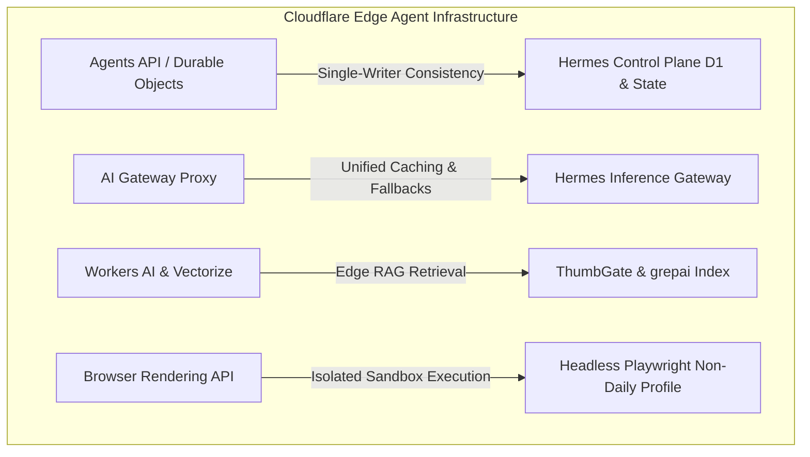

# Cloudflare Agents Week Architecture Blueprint

> **Adapting Cloudflare's Edge Agent Infrastructure (Durable Objects, AI Gateway, Workers AI) for Hermes YOLO**

This document maps the architectural innovations announced during **Cloudflare Agents Week** (`blog.cloudflare.com/tag/agents-week/`) directly into our local and control-plane agent architecture.

---

## 1. Cloudflare Agents Week Core Pillars

---

## 2. Architectural Adaptations for Hermes YOLO

### Pillar 1: Durable Agent State & Single-Writer Consistency
- **Cloudflare Pattern:** Durable Objects provide each AI agent with isolated, single-writer state consistency, transactional storage, and WebSocket streaming.
- **Hermes Implementation:** `apps/hermes-control-plane` uses SQLite/D1 session tables and [`plan.md`](file:///Users/igorganapolsky/workspace/git/igor/mac-yolo-safeguards/plan.md) file locks to guarantee single-agent file ownership without race conditions.

### Pillar 2: Edge AI Gateway & Provider Fallbacks
- **Cloudflare Pattern:** AI Gateway acts as a proxy providing prompt caching, unified token billing, rate limiting, and automated fallback routes across model providers.
- **Hermes Implementation:** [`tools/hermes-inference-gateway.js`](file:///Users/igorganapolsky/workspace/git/igor/mac-yolo-safeguards/tools/hermes-inference-gateway.js) logs daily append-only JSONL traces (`~/.hermes/inference-traces/YYYY-MM-DD.jsonl`) and computes real-time cost, latency, and reliability metrics.

### Pillar 3: Sandboxed Browser Rendering (No Desktop Hijack)
- **Cloudflare Pattern:** Headless browser contexts run in isolated cloud containers without access to user desktop profiles or browser sessions.
- **Hermes Implementation:** Enforces [`docs/NO-DESKTOP-HIJACK.md`](file:///Users/igorganapolsky/workspace/git/igor/mac-yolo-safeguards/docs/NO-DESKTOP-HIJACK.md): browser tasks run strictly in dedicated, headless non-daily profiles.

---

## 3. Verification & Compliance Suite

- **Cloudflare Agents Harness:** `node tools/cloudflare-agents-harness.js`
- **Context Layer Suite:** `node tests/test-session-context.js` (19/19 PASSED)
