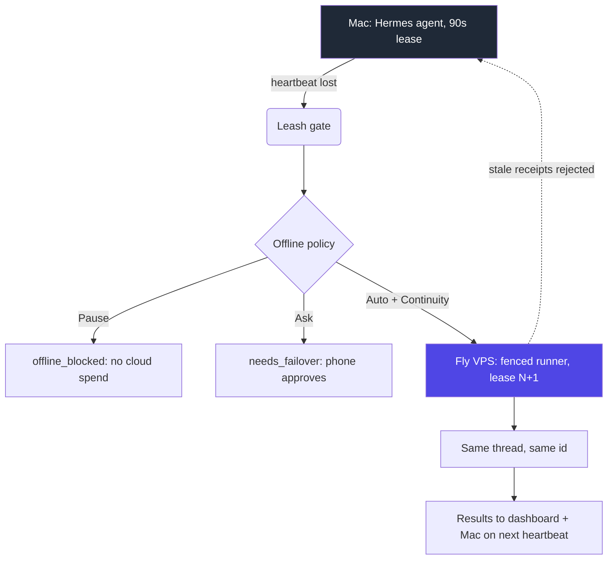

# Cloud Continuity — architecture & definition

> Short form: **Cloud Continuity fails over a *paired Mac's* in-flight task thread to a fenced Fly VPS runner under a 90-second lease.** It is a queued handoff, not live process migration, and it is not reachable until a machine is paired (and the org has the Continuity entitlement).

## 1. What Continuity is (and is not)

| | |
|---|---|
| **Is** | A recoverable handoff: when the paired Mac's local `90s` lease expires (lid closed / offline / heartbeat lost), the *exact prompt + thread state* is queued and a **single** fenced Fly VPS runner claims a fresh lease (generation `N+1`) and resumes that same thread. Stale Mac receipts are rejected by the lease gate. |
| **Is not** | Live process migration, unlimited primary compute, or "the agent never stops." The Mac is primary; the VPS is a recoverable continuation of work that *originated on that Mac*. |
| **Scope** | One task thread ↔ one lease ↔ one executor at a time. No double-write. |
| **Stack** | ThumbGate control plane (Cloudflare Worker + D1) → Fly.io fenced VPS runner; WorkOS auth; Stripe billing. See `lib/task-leases.ts`, `services/hermes-cloud-runner/server.js`. |

## 2. The pairing prerequisite (why you saw "pair a computer first")

A Continuity handoff has a **source**: the Mac that owns the active task thread. With no paired Mac, there is no thread to fail over, so the dashboard cannot build a continuation. `createTask()` in `apps/hermes-control-plane/app/dashboard/DashboardClient.tsx` enforces this:

```ts
const hasCloud = Boolean(organization?.cloudAccess);            // Continuity entitlement
const effectiveRoute =
  routePreference === "cloud" || (!devices.length && hasCloud) ? "cloud" : routePreference;
if (!devices.length && effectiveRoute !== "cloud") {
  setNotice("Pair your computer below, or switch target to Continuity (Cloud VPS).");
  return;                                                       // gates on a paired Mac
}
```

Two distinct blockers map to that one message today:

1. **No paired Mac** → correct gate: pair a machine first (the free path).
2. **Free tier / no `cloudAccess`** → the suggested escape hatch ("switch target to Continuity") is a dead end, because `hasCloud === false` means the cloud route is unreachable. The UI offers an option the plan cannot fulfil.

## 3. Flow diagram

```
  Your Mac (primary)                       ThumbGate control plane               Fly.io fenced VPS runner
  ┌─────────────┐  online                 ┌─────────────────────┐               ┌─────────────────────┐
  │ Hermes      │◄──90s lease────────────│ Leash gate: approve/│   queued      │  fenced executor    │
  │ agent       │  (signed, local only)  │ deny each tool call │◄──handoff────│  takes lease N+1    │
  └─────┬───────┘                        └─────────┬───────────┘               └──────────┬──────────┘
        │ lid closed / offline                      │ stale Mac lease CANNOT overwrite
        ▼  heartbeat lost                           ▼
  ┌─────────────────────────────────┐   ┌─────────────────────────────────────┐
  │ Offline policy (per task)         │   │  FREE: Pause  (offline_blocked)      │
  │ Pause │ Ask (1-tap phone) │ Auto  │   │  ASK : needs_failover (phone tap)    │
  │       └─ Auto needs Continuity ──┘   │  AUTO: cloud runner takes over       │
                                        └─────────────────────────────────────┘
                                                                  │ completes
                                                                  ▼
                         results sync back: dashboard (immediate) + Mac (next heartbeat)
```



## 4. The prerequisite contract (for the public page)

The landing page / FAQ should say, up front:

> **Requires a paired Mac.** Cloud Continuity fails over *your Mac's* in-flight task thread to a fenced VPS runner. With no paired Mac there is no thread to continue, so the dashboard asks you to pair one first. Free Web Control is Mac-only; Continuity adds the cloud continuation on top.

## 5. Positioning caveat (2026-07-31)

`config/THUMBGATE_EXPERT_CARD.txt` flags that the "Mac goes offline → cloud" premise is **contested**: if an agent runs always-on in someone's cloud (Abacus SuperComputer, Nous hosted, MiniMax, Block Buzz) there is no lid to close, and the $10 Continuity tier is "indefensible from four directions" — positioning now says *"sell the gate, not the runtime."* Do **not** market Continuity as compute; market it as recoverable continuation + the Leash gate.

## 6. SKUs (live read-back; re-read `/api/billing/plan` before any copy)

- **Web Control** — free while Mac is online (Mac-only).
- **Pro Continuity** — $10/mo (100 cloud continuations / 30 days, 14-day trial with 5 runs).
- **Team / Enterprise** — $49/mo (500 continuations / 30 days, BYO key, priority Fly runner).

Caps are enforced server-side at lease-claim time (`lib/agent-governance.ts`).

## 7. Interactive viz + runtime details

- Interactive flow component: `apps/hermes-control-plane/app/FailoverPathDemo.tsx` (Approve → Deny → Lid-close → Governed continuation).
- Lease/runtime detail: `docs/HERMES-CLOUD-FAILOVER.md`, `apps/hermes-control-plane/lib/task-leases.ts`, `services/hermes-cloud-runner/`.

## 8. Open UX issue (filed)

`DashboardClient.tsx` `createTask()` (lines 729-738) offers "switch target to Continuity (Cloud VPS)" as an escape from the no-device gate, but for free-tier orgs (`hasCloud === false`) that target is unreachable → dead-end. Suggested fix: branch the notice — no device + no entitlement renders two CTAs ("Pair a Mac" → `#pair`, "Continuity requires a paid plan" → `/api/billing/checkout`); has entitlement but no device renders "Pair a Mac to seed the thread you'll fail over."
