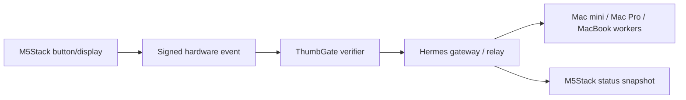

# Hermes Hardware Leash

M5Stack is useful for Hermes as a physical control surface: buttons, tiny screens,
LEDs, buzzers, and sensors that stay available when the phone app, browser, or
Wi-Fi pairing flow is annoying.

The high-ROI use is not "run Hermes on the device." The high-ROI use is:

- approve or deny a specific ThumbGate card;
- pause all new outbound actions and new jobs;
- show all-Mac gateway health;
- flash verified payment, refund/dispute, CI, and E2E alerts;
- keep a desk-visible operator panel that does not burn premium model tokens.

## Architecture



The device never deploys, merges, posts, refunds, sends payment links, or changes
scope directly. It emits a signed intent. ThumbGate decides whether that intent
matches a real pending action.

## Device Roles

| Device class | Best Hermes role |
| --- | --- |
| M5Stack Core, Core2, Tab | Desk approval console |
| M5Stick, Atom | Per-Mac health puck |
| Cardputer | Portable operator keyboard |
| CoreInk / e-paper | Always-on fleet display |

## Event Contract

Example approve event:

```json
{
  "version": 1,
  "event_type": "thumbgate.decision",
  "source": "m5stack_hardware_leash",
  "device_id": "desk-core2",
  "button": "approve",
  "decision": "approve",
  "action_id": "gate_123",
  "requires_thumbgate": true,
  "ttl_seconds": 300,
  "ts": "2026-06-29T03:00:00.000Z",
  "signature": "sha256=..."
}
```

`approve` and `deny` require `action_id`. That prevents a physical button from
approving whatever happens to be waiting next.

`pause` and `resume` are global operator controls:

```json
{
  "button": "pause",
  "event_type": "hermes.operator_control",
  "control": "pause_outbound_and_new_jobs",
  "scope": "all_macs",
  "requires_thumbgate": true
}
```

## Local Simulator

The repo includes a dependency-free simulator:

```bash
node tools/hermes-hardware-leash.js snapshot --json
node tools/hermes-hardware-leash.js event --device-id desk-core2 --button pause --secret test-secret --json
node tools/hermes-hardware-leash.js event --device-id desk-core2 --button approve --action-id gate_123 --secret test-secret --json
```

It also includes a local firmware-facing endpoint:

```bash
HERMES_HARDWARE_LEASH_SECRET="device-secret" node tools/hermes-hardware-leash.js server --port 8795
```

Endpoints:

- `GET /health`
- `GET /snapshot`
- `POST /event`

Valid `POST /event` requests are verified and appended to
`~/.hermes/hardware-leash-events.jsonl`. The endpoint does not execute deploys,
posts, merges, refunds, or payment operations.

Secrets are read from `HERMES_HARDWARE_LEASH_SECRET` or passed explicitly for
tests. Do not commit real device secrets.

Optional local config lives outside the repo:

```json
{
  "machines": [
    { "id": "mac-mini", "label": "Mac mini", "gateway_url": "http://100.x.y.z:8642" },
    { "id": "mac-pro", "label": "Mac Pro", "gateway_url": "http://127.0.0.1:8642" }
  ],
  "thumbgate": {
    "pending_cards": [
      { "action_id": "gate_123", "title": "Deploy approval" }
    ]
  }
}
```

Default path: `~/.hermes/hardware-leash.json`.

## Firmware Pattern

1. Device polls a read-only snapshot endpoint or receives an MQTT/WebSocket
   update.
2. Device displays `display.title`, `display.primary_line`, `display.secondary_line`,
   and `display.color`.
3. Button press creates `{ device_id, button, action_id, ts }`.
4. Device signs the canonical event with its per-device secret.
5. Hermes/ThumbGate verifies signature, allowlist, timestamp window, and action
   match before forwarding.

## Safety Rules

- Per-device secrets stay on the device or in `~/.hermes`, never in git.
- Reject signatures older than five minutes by default.
- Device IDs must be allowlisted before production use.
- One button press equals one event; no repeat-fire loops.
- Approval buttons must include an exact pending `action_id`.
- `pause` is always allowed to request a stop, but the gateway records it as a
  ThumbGate-controlled operator event.

## Rollout Plan

1. Simulator only: keep tests green and validate event shape.
2. One desk device: approve/deny only, no production side effects.
3. All-Mac fleet display: online/offline gateway status across Mac mini, Mac Pro,
   and MacBook.
4. Alert routing: payment, refund/dispute, CI, E2E, and job-failure flashes.
5. Optional relay integration: signed events can travel over the same Hermes
   relay path as mobile approvals once that backend is the stable source of truth.
