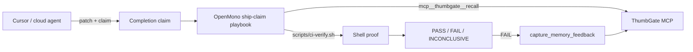

# OpenMonoAgent anti-hallucination stack

Pair [OpenMonoAgent](https://www.openmonoagent.ai/) (local verifier) with Cursor (cloud proposer)
and ThumbGate (memory). OpenMono runs proof commands; ThumbGate blocks repeat mistakes.

## Architecture



## Install (once per Mac)

```bash
bash <(curl -fsSL https://raw.githubusercontent.com/StartupHakk/OpenMonoAgent.ai/refs/heads/main/get-openmono.sh)
openmono start   # llama-server :7474
```

Project config is already in [`.openmono/settings.json`](../.openmono/settings.json) (ThumbGate MCP,
verifier temperature, bash allowlist). Playbook: [`.openmono/playbooks/ship-claim/`](../.openmono/playbooks/ship-claim/).

## Daily loop

1. **Cursor** implements and says e.g. "CI passed" or "Firebase shipped".
2. **OpenMono** (in this repo):

   ```bash
   cd ~/workspace/git/igor/mac-yolo-safeguards
   openmono agent
   ```

   Then invoke:

   ```
   /ship-claim --claim "CI passed and Firebase distributed Hermes 0.2.0" --scope hermes-mobile --task internal-distribution.yml
   ```

3. Read **VERDICT**. Only accept Cursor's claim if OpenMono returns **PASS** with cited command output.
4. On **FAIL**, fix or re-run CI; capture lesson via playbook step 6 or ThumbGate directly.

## Scopes

| `--scope` | Runs |
|-----------|------|
| `repo-root` | Full `scripts/ci-verify.sh` |
| `hermes-mobile` | `npm run release:check`, typecheck, test:ci |
| `docs-only` | Public funnel checks only (fast) |

If the claim mentions GitHub Actions, the proof script also runs `gh run list` when `gh` is available.

## Cursor + OpenMono side-by-side

OpenMono ships a [VS Code / Cursor extension](https://marketplace.visualstudio.com/items?itemName=StartupHakk.openmono-agent)
(ACP on port 7475). Optional: cloud panel proposes, local panel runs `/ship-claim` on the same workspace.

## What this does not fix

- Local LLMs can still hallucinate — **scripts exit non-zero**, gates require human **Review**, and
  ThumbGate captures repeats. See [OpenMono playbooks docs](https://github.com/StartupHakk/OpenMonoAgent.ai/blob/main/docs/PLAYBOOKS.md).
- Hermes Mobile Firebase ship still needs EAS + signing aligned; this playbook only **verifies** claims.

## Related

- Canonical agent rules: [`AGENTS.md`](../AGENTS.md)
- Local inference probe: `node tools/local-inference-readiness.js`
- OpenMono ROI gate: `node tools/openmono-roi-audit.js`
- Kimi K2.7 Code upgrade gate: `node tools/kimi-model-upgrade-audit.js`
- Paid hardening offer: [`docs/AI-AGENT-HARDENING.md`](./AI-AGENT-HARDENING.md)
