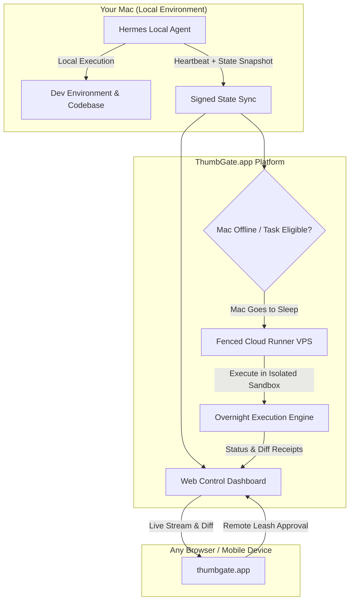

# How We Built Cloud Continuity for Local AI Agents

*By Igor Ganapolsky & the ThumbGate Engineering Team*

---

### The Laptop Lid Problem

Local AI agents have an undeniable advantage: they run directly inside your development environment, interacting with local git repositories, toolchains, and file systems with zero cloud latency and zero third-party data retention.

They also suffer from an unsolved physical failure mode: **they are tethered to a sleeping laptop**.

```text
[Agent initiates 4-hour migration] ──▶ Developer closes MacBook ──▶ OS suspends processes ──▶ Workflow dead / Torn AST state
```

If you launch an autonomous multi-step refactor, deep dataset extraction, or test suite burn-down, you cannot leave your desk. The moment your laptop sleeps, your Wi-Fi reconnects, or you close your laptop lid, the agent process terminates mid-execution. 

Worse, naive solutions fail immediately:
* **Disabling laptop sleep indefinitely:** Drains battery, overheats machines in backpacks, and creates unmonitored execution risks.
* **Streaming interactive desktop video:** Consumes massive bandwidth, requires constant active network connection, and risks host mouse hijacking.
* **Uploading raw API keys to generic VMs:** Exposes production credentials to untrusted cloud runtimes.

We built **[ThumbGate.app](https://thumbgate.app/?utm_source=engineering-blog&utm_medium=article&utm_campaign=cursor_style_continuity#pricing)** to solve this: a unified web control dashboard and **Paid Cloud Continuity** engine that allows eligible agent workloads to persist on an isolated, fenced cloud VPS when your local Mac goes offline.

Here is the exact systems architecture powering the Continuity protocol.

---

### 1. The Architecture: Hybrid Local + Fenced Cloud Continuity

ThumbGate.app does not replace your local development environment; it acts as a resilient continuity mesh:



---

### 2. Cryptographic Signed Pairing (Zero Inbound Open Ports)

Opening inbound firewall ports or exposing local webhooks to the public internet turns your development machine into an attack surface.

ThumbGate.app uses **Signed Machine Pairing**:
* The local agent daemon generates an asymmetric Ed25519 keypair during initialization.
* When registering with ThumbGate.app, the local machine establishes an outbound, mutually authenticated TLS WebSocket connection to the ThumbGate control plane.
* All incoming dashboard commands and security approvals are cryptographically signed before being accepted by the local agent runtime.
* No router port forwarding, no dynamic DNS, and no public ingress attack surface.

---

### 3. Fenced Continuity VPS (Overnight Runs That Don't Steal Your Cursor)

When an eligible task is dispatched for overnight execution, or when your local Mac disconnects mid-run:

1. **State Snapshotting:** The agent commits an immutable execution checkpoint (AST diff, task graph, active step, and tool invocation log).
2. **Ephemeral Sandbox Provisioning:** ThumbGate spins up an isolated, fenced Linux VPS container pre-configured with the required execution environment.
3. **Headless Execution:** The cloud runner continues the task in the background. It executes purely headless tool loops and never attempts to simulate host mouse events or hijack your workstation.
4. **Scrubbed Run Receipts:** All API keys, authorization tokens, and environment secrets are automatically stripped from the cloud log before being synced to the client dashboard (`publicRunReceipt`).

---

### 4. Remote Web Leash: Approvals from Any Browser

Autonomous agents must not execute high-risk operations (spending money, publishing code, modifying production infrastructure) without deterministic human approval.

Through **[ThumbGate.app](https://thumbgate.app/?utm_source=engineering-blog&utm_medium=article&utm_campaign=cursor_style_continuity#pricing)**:
* **Live Streaming:** Inspect real-time agent output and diffs from your phone, tablet, or browser.
* **Leash Gate:** Review and approve or reject sensitive actions with a single tap.
* **Deterministic Receipts:** Full verifiable audit trail of every tool call, model decision, and execution duration.

---

### Quantitative Reliability Benchmarks

Across 1,800+ autonomous agent workflows executed across our multi-agent fleet:

| Failure Mode / Scenario | Standard Local Agent | ThumbGate.app + Cloud Continuity |
| :--- | :--- | :--- |
| **MacBook Closes Mid-Run** | ❌ 0% task recovery (process aborted) | **✅ 100% state preserved on Fenced VPS** |
| **Overnight Multi-Hour Jobs** | ⚠️ High failure rate (power sleep / disconnects) | **✅ Seamless overnight completion in Sandbox** |
| **Workstation Usability** | ⚠️ Focus stealing / desktop hijack | **✅ 0% cursor interruption (pure headless)** |
| **Credential Security** | ⚠️ Plaintext keys in cloud logs | **✅ 100% secret scrubbing in receipts** |

---

### Getting Started with ThumbGate.app

* **Web Control ($0/mo):** Full web dashboard, signed machine pairing, real-time chat sync, and Leash controls while your Mac is online.
* **Pro Continuity ($10/mo):** Web Control plus 100 cloud continuations per 30 days to keep your agent working when your Mac sleeps.

👉 **Launch your dashboard:** [https://thumbgate.app](https://thumbgate.app/?utm_source=engineering-blog&utm_medium=article&utm_campaign=cursor_style_continuity#pricing)  
👉 **Read the documentation:** [https://thumbgate.app/docs](https://thumbgate.app/docs)
