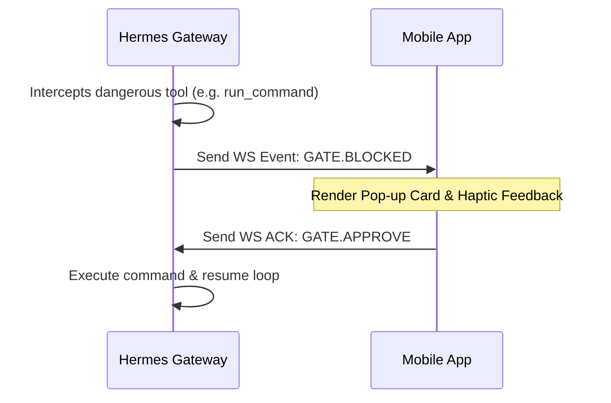

# Hermes Mobile Companion App Architecture

This document defines the technical architecture, security model, and API contracts for the **Hermes Mobile Companion App**. 

Rather than replacing the full Hermes Desktop workspace, the mobile app acts as a **couch companion** specifically designed to handle background notifications, YOLO safeguard audits, and remote ThumbGate approvals.

---

## 1. Phased MVP Roadmap

To maximize developer velocity, the app follows a phased rollout starting with HTTPS/WebSocket tunnels before building custom native modules.

| Phase | Target Scope | Key Dependencies |
| :--- | :--- | :--- |
| **v0.1 (MVP)** | <ul><li>HTTPS/WebSocket connectivity</li><li>Active session monitoring</li><li>Live approval queue & push alerts</li><li>Secure credential storage</li><li>Gateway health pill</li></ul> | `expo-secure-store`, `expo-notifications` |
| **v0.2 (Workspace)** | <ul><li>Log streaming virtualization</li><li>Color-coded Git diff viewer sheet</li><li>Webview screenshots & state preview</li></ul> | `@shopify/flash-list`, `react-native-webview` |
| **v0.3 (Advanced)** | <ul><li>Optional direct background SSH Tunneling</li></ul> | Custom Swift/Kotlin TurboModule |

---

## 2. Security & Storage Model

Because the mobile client connects to a local developer machine and holds sensitive credentials, security is a first-class citizen:

*   **API Key Storage:** The Hermes Bearer Token (`sk-...`) must never be stored in plain text (e.g., standard `AsyncStorage`). It must be persisted using `expo-secure-store`, which utilizes **iOS Keychain** and **Android KeyStore** (AES-256 in GCM mode).
*   **Tunnel URL Security:** Public ngrok or Cloudflare tunnel URLs are treated as **capability URLs**. All HTTP endpoints and WebSocket handshakes require a valid `Authorization: Bearer <key>` header.
*   **No Hardcoded Secrets:** No dev tokens or fallback credentials may be committed to this repository. All credentials must be entered at runtime on the Settings screen.

---

## 3. ThumbGate Event Contract & Approval Protocol

The gateway and mobile app communicate via WebSockets (`wss://<tunnel-url>/v1/events`).



### Event: Gateway -> Mobile (`GATE.BLOCKED`)
Sent when a command matches a ThumbGate block rule or YOLO safeguard threshold and halts execution.
```json
{
  "event": "GATE.BLOCKED",
  "timestamp": "2026-06-15T15:20:15.123Z",
  "payload": {
    "actionId": "act_1781536830_9f2k1d",
    "toolName": "run_command",
    "reason": "Pre-action rule blocked execution to prevent memory runaway.",
    "command": "node tests/test-runaway.js --force-leak",
    "workspacePath": "/Users/igorganapolsky/workspace/git/igor/mac-yolo-safeguards",
    "diff": "--- a/sim-runaway-guard.sh\n+++ b/sim-runaway-guard.sh\n@@ -124,1 +124,2 @@\n-  if [ \"$mem_pct\" -lt 10 ]\n+  local min_pct=${YOLO_MEM_FREE_PCT_THRESHOLD:-15}"
  }
}
```

### Event: Mobile -> Gateway (`GATE.ACTION`)
Sent when the operator taps "Approve Override" or "Reject / Terminate".
```json
{
  "event": "GATE.ACTION",
  "timestamp": "2026-06-15T15:20:20.456Z",
  "payload": {
    "actionId": "act_1781536830_9f2k1d",
    "decision": "approve", // or "reject"
    "operatorNote": "Approved override from mobile client"
  }
}
```

### Event: Gateway -> Mobile (`RECLAIM.FIRED`)
Broadcast logs when the YOLO guard performs automatic health hygiene (non-blocking).
```json
{
  "event": "RECLAIM.FIRED",
  "timestamp": "2026-06-15T15:20:26.789Z",
  "payload": {
    "target": "Google Chrome Canary",
    "rssReclaimedMb": 280,
    "triggerCondition": "swap=84%"
  }
}
```

---

## 4. Connection & Gateway Health Integration

Health probes mirror `hermes_cli.web_server` and `tools/hermes-productivity-audit.js`:

| Endpoint | Purpose |
|---|---|
| `GET /health/detailed` | Full gateway state (preferred) |
| `GET /health` | Simple fallback |
| `WS /v1/events` | ThumbGate + reclaim event stream (contract §3) |

**Health pill levels:**

- **Green:** `status=ok` and `gateway_state=running`
- **Amber:** partial OK (e.g. gateway up but platform disconnected)
- **Red:** probe failed or critical state

Local state file: `~/.hermes/gateway_state.json` (read by Mac-side audit tools; mobile uses HTTP probes).

---

## 5. LipoShield Pattern Reference (sibling app)

Hermes Mobile mirrors the proven structure from [`../../LipoShield`](../../LipoShield) — Igor's shipped Expo app:

| LipoShield pattern | Hermes Mobile equivalent |
|---|---|
| `App.tsx` + `@react-navigation/bottom-tabs` | Same — custom glass tab bar, dark theme |
| `src/services/storage.ts` (AsyncStorage) | Settings flags in AsyncStorage |
| `src/context/EntitlementContext.tsx` | `src/context/GatewayContext.tsx` (connection + approvals) |
| `src/components/GlassCard.tsx` | Reused glass card styling |
| `src/components/ErrorBoundary.tsx` | Root error boundary |
| `src/services/haptics.ts` | Gate approve/reject feedback |
| `jest` + `jest-expo` + coverage | `npm run test:ci` |
| `.maestro/` E2E (future) | Planned for approval flow smoke |

**Intentional differences:**

- **Secrets:** API keys in `expo-secure-store` (Keychain), not AsyncStorage — LipoShield stores non-secret prefs only.
- **Network:** Live gateway `/health` probes + `/v1/events` WebSocket (contract in §3).
- **No RevenueCat:** Hermes is an operator tool, not a consumer subscription app.

---

## 6. Local Development

```sh
cd hermes-mobile
npm install
npm run typecheck
npm run test:ci
npx expo start
```

**Gateway prerequisites on the Mac:**

1. `API_SERVER_ENABLED=true` and `API_SERVER_KEY=...` in `~/.hermes/.env`
2. `hermes gateway start` (or LaunchAgent `ai.hermes.gateway`)
3. Optional tunnel: ngrok / Cloudflare → paste URL in Settings

**Demo mode:** Settings → Demo mode ON → Approvals tab → tap inject demo `GATE.BLOCKED` without a live WebSocket.

---

## 7. Strategic Recommendation (unchanged)

Start with **React Native (Expo 55)** + HTTPS tunnel. Add native SSH TurboModule only if direct port-forward becomes a hard requirement. See original research doc for full RN vs native tradeoff matrix.
