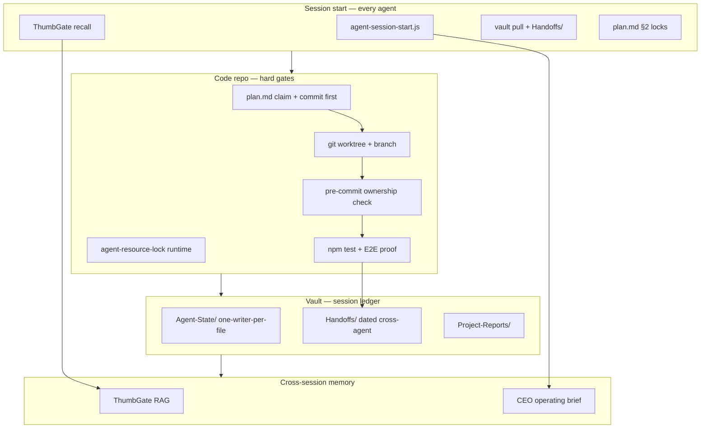

# Multi-Agent Vault Coordination — July 2026 Playbook

**Audience:** Igor's AI fleet (Cursor, Claude Code, Codex, Gemini, Antigravity, Hermes, Replit, Obsidian AI Agent)  
**Canonical vault:** `~/Documents/AI-Agent-Sync` (`IgorGanapolsky/AI-Agent-Sync`)  
**Execution repos:** per-project git trees (primary: `mac-yolo-safeguards`)  
**Last verified:** 2026-07-10

This document synthesizes Igor's **proven July 2026 fleet protocol** (vault + `plan.md` + enforcement tools) with industry research on governed shared memory, fleet orchestration, git worktree isolation, and Cursor multi-agent scaling.

---

## Executive summary

On **2026-07-02**, four agents editing one git tree caused hours of lost work: uncommitted fixes vanished on branch switches, `main` oscillated, and the phone received stale builds. **Root cause was coordination, not code.** The durable fix is a **dual-layer model**:

| Layer | Where | Role | Authority |
|-------|-------|------|-----------|
| **Task locks** | `<repo>/plan.md` §1–§2 | Who may edit which files | **Hard gate** — pre-commit + agent discipline |
| **Session ledger** | `AI-Agent-Sync` vault | Handoffs, fleet health, cross-project context | **Soft signal** — reduces collisions, not a mutex |
| **Lessons / mistakes** | ThumbGate RAG | Cross-session anti-patterns | **Recall before act; capture after fix** |
| **Operator brief** | `node tools/agent-session-start.js` | CEO brief, E2E proof, plan snapshot | **Session entry ritual** |

**North star:** One agent per **git worktree + branch** on code repos; one writer per **Agent-State** file in the vault; cross-agent messages only in **dated `Handoffs/`** notes.

---

## What failed (2026-07-02 → 2026-07-06 lessons)

Documented in vault `Handoffs/2026-07-02-mac-yolo-safeguards-coordination.md`, `Handoffs/2026-07-03-hermes-mobile-multiagent-chaos.md`, `Handoffs/2026-07-06-URGENT-cursor-commit-trapped-attachments-leashpro.md`.

| Failure | Symptom | Root cause |
|---------|---------|------------|
| **Shared worktree thrashing** | Fixes reverted silently; `main` reset minute-to-minute | Multiple agents on one checkout; `git switch` / branch ops without commits |
| **Uncommitted "done" work** | T-89 attachments, T-80 Leash Pro marked done in `plan.md` but absent from `origin/main` | Done + tested locally, never committed — invisible to builds |
| **Lock overlap ignored** | `GatewayContext.tsx` edited by claude-code while gemini T-1 owned it | Agents skipped `plan.md` read; no pre-commit yet |
| **Duplicate agent instances** | Two Claude Code sessions overwrote `Agent-State/claude-code.md` | One-file-per-agent-type insufficient when **same type** runs two repos |
| **Vault drift** | Agents read stale `main`; 21 coordination files missing from `origin/main` (2026-07-09) | Malformed frontmatter blocked merge; protected branch never advanced |
| **Generated sync file churn** | `AI Agents/Hermes Agent Sync.md` dirty on every Mac | Machine-local artifact committed to vault — now gitignored per `VAULT-HYGIENE.md` |

**Permanent rule:** If work keeps getting lost, the answer is **not another build** — it is **claim → worktree → commit → handoff**.

---

## Architecture: dual-layer + evidence stack



### Layer responsibilities

**`plan.md` (repo-local)** — live task board, file ownership map, append-only decisions log. Claim **before** edit; commit `plan.md` **first**. Machine-readable: `node tools/plan-coordination-snapshot.js --json`.

**Vault (cross-repo)** — survives code-repo branch churn because it is a **separate git repo**. Holds people, handoffs, health, project homes (`Projects/README.md`). Does **not** replace file locks.

**ThumbGate** — semantic lessons ("MISTAKE: clobbered gemini T-1"). Query at session start; capture after incidents with concrete artifacts (SHAs, paths, exit codes).

**CEO brief** — `node tools/agent-session-start.js` (add `--full` before ship claims). Prints continuous E2E from `latest.json`, LaunchAgent health, plan snapshot.

---

## One-writer-per-state-file vs other patterns

July 2026 research and Igor's vault converge on **filesystem blackboard** coordination with strict write boundaries.

| Pattern | Mechanism | Igor fit | Risk |
|---------|-----------|----------|------|
| **One-writer-per-state-file** | Each agent type owns `Agent-State/<agent>.md` | **Default** — Obsidian last-write-wins safe only here | Same agent type, multiple instances → collision |
| **Private namespace per agent** | `agents/<id>/` disjoint trees ([agent-vault](https://github.com/yehudalevy-collab/agent-vault)) | Use **Handoffs/** as namespace when instance collision | More paths to discover |
| **Append-only shared log** | `events.md` line union ([agent-vault](https://github.com/yehudalevy-collab/agent-vault)) | Partial — vault `Handoffs/` are whole files, not line log | Merge conflicts on same file |
| **Atomic task claims** | MCP task queue with claim metadata ([obsidian-mcp-server](https://github.com/t-rhex/obsidian-mcp-server/)) | Future option; not primary today | Requires MCP server always on |
| **Governed memory service** | Scoped retrieval, supersession, provenance ([MemClaw arxiv:2606.24535](https://arxiv.org/html/2606.24535v1)) | **ThumbGate** approximates lessons layer | Not a real-time lock |
| **Real-time file locks** | Shared lock file in repo | **Rejected** — Cursor proved lock contention caps throughput at 2–3 agents ([Cursor scaling blog](https://cursor.com/blog/scaling-agents)) | Deadlocks, fragility |

### Igor rules (canonical)

1. **Write ONLY your `Agent-State/<your-agent>.md`.** Never edit another agent's state file.
2. **Same agent type, second live instance?** Check `git log -1 -- Agent-State/<file>` and `## Workspace Context`. If another repo/runtime owns it recently → write **`Handoffs/YYYY-MM-DD-<topic>.md`** instead.
3. **Cross-agent messages** → `Handoffs/` only (not `Agent-State/`).
4. **Vault commit:** `git add <explicit paths>` — **never `git add -A`** on the vault (external vault policy: `AI-Agent-Sync/VAULT-HYGIENE.md`).
5. **Regenerated artifacts** (`Hermes Agent Sync.*`) live in repo `artifacts/agent-sync/` — not vault git.

---

## Session-boundary ledger vs real-time locks

Industry consensus (O'Reilly 2026, Atlan 2026, Governed Memory papers): multi-agent systems fail when **messaging substitutes for shared truth** — agents need governed state, not chat relay.

| Approach | What it guarantees | Igor implementation |
|----------|-------------------|---------------------|
| **Session-boundary ledger** | Other agents see your intent **after** pull + read | Vault `Handoffs/`, `Agent-State/`, `git pull` at session start |
| **Optimistic concurrency** | Retry on conflict; no blocking | Git merge conflicts at PR time; not during active edit |
| **Pessimistic file locks** | Exclusive access during edit | `plan.md` §2 + **pre-commit** (`T-37`) — blocks *staging*, not reading |
| **Runtime mutex** | One Metro/ADB/E2E holder | `tools/agent-resource-lock.js` — `hermes-mobile-runtime` lease |
| **Real-time vault lock** | Live mutex in Obsidian | **Not used** — Obsidian has no locking; diff-match-patch is last-write-wins |

**Critical distinction:** `git status --porcelain` on the vault showing uncommitted files = **another agent is LIVE** — treat named repos/files as claimed until they commit or abandon.

**Cadence:**

```
SESSION START:  vault pull → read latest Handoffs → read plan.md §2 → agent-session-start.js → ThumbGate recall
BEFORE EDIT:    claim plan.md → commit plan.md → worktree if shared tree dirty
DURING:         no git switch on primary checkout with foreign dirty files
SESSION END:    commit code → Handoffs note if cross-agent → update own Agent-State → vault commit+push → agent-sync-brief if plan.md changed
```

---

## `plan.md` + vault: who owns what

| Concern | `plan.md` | Vault |
|---------|-----------|-------|
| File locks / task status | ✅ Authority | ❌ Mirror only in Handoffs |
| Cross-project index | Link in repo `OBSIDIAN.md` | ✅ `Projects/README.md` |
| Durable handoff narrative | Decisions log (append) | ✅ `Handoffs/YYYY-MM-DD-*.md` |
| Fleet / gateway health | E2E path in repo | ✅ `Agent-State/latest.json`, `Health/` |
| Lessons / mistakes | Brief in decisions | ✅ ThumbGate (primary) |
| Secrets | ❌ Never | ❌ Never |

**Sync packet:** After major `plan.md` changes:

```bash
node tools/agent-sync-brief.js --vault ~/Documents/AI-Agent-Sync
```

Writes redacted Markdown+JSON to `artifacts/agent-sync/` and optionally updates vault `AI Agents/Hermes Agent Sync.md` (gitignored in vault — see hygiene runbook). Packet includes: active tasks, active locks, dirty worktree, E2E status, Replit agent state, blockers, recent decisions.

---

## Git worktree isolation (mandatory for parallel agents)

Research consensus ([Zylos](https://zylos.ai/research/2026-02-22-git-worktree-parallel-ai-development/), [MindStudio](https://www.mindstudio.ai/blog/git-worktrees-parallel-ai-coding-agents), [Augment Code](https://www.augmentcode.com/guides/git-worktrees-parallel-ai-agent-execution)): **filesystem isolation per agent** is the 2026 default for parallel coding.

```bash
# Never switch branches on a dirty shared main worktree
git fetch origin
git worktree add -b feat/my-task ../mac-yolo-feat-my-task origin/main
cd ../mac-yolo-feat-my-task
# claim in plan.md, commit plan.md first, then edit
```

**Cap concurrency:** 2–3 agents on `hermes-mobile` (tightly coupled). More → sequential merge onto `main` with tests + Maestro E2E.

**Replit / phone:** separate clone entirely — coordinate via vault + PR, not shared worktree.

---

## Cursor Multitask Mode — do NOT duplicate workers

Cursor's own scaling research ([Scaling long-running autonomous coding](https://cursor.com/blog/scaling-agents)) documents what **not** to do:

| Anti-pattern | Why it fails | Igor equivalent |
|--------------|--------------|-----------------|
| Flat peer agents + shared lock file | Lock contention; effective throughput → 2–3 agents | Multiple Cursor chats editing same files without `plan.md` claim |
| Duplicate planners on same task | Duplicate PRs, revert wars | Two Cursor agents both "fixing chat send" on `main` |
| Workers coordinating with workers | Bottleneck, drift | Cursor subagents both touching `GatewayContext.tsx` |
| No periodic reset / judge | Tunnel vision, long runs | Never reading `latest.json` or vault Handoffs mid-flight |

**Recommended Cursor posture:**

1. **One parent task per file domain** — check `plan.md` §2 before spawning subagents.
2. **Subagents inherit worktree** — parent creates worktree; children do not share parent's dirty `main`.
3. **Do not spawn a second worker** for a file already `in_progress` by codex/gemini/etc.
4. **Planner reads vault; workers do not write vault** — only parent updates `Handoffs/` at session end.
5. **Multitask ≠ more agents on same lock** — parallelize **disjoint** file sets only.

Hierarchy that scales: **planner (reads plan + vault) → worker (single file set) → verifier (tests + latest.json)** — matches Cursor's planner-worker-judge cycle.

---

## Integration: ThumbGate RAG + CEO brief

| When | Tool | Purpose |
|------|------|---------|
| Session start | `mcp__thumbgate__recall` or `node tools/agent-decision-stack.js --task "..." --json` | Surface MISTAKE lessons matching current work |
| Before ship/fixed claims | `node tools/agent-session-start.js --full` | Jest CI + E2E status + CEO brief |
| After incident/fix | `mcp__thumbgate__capture_memory_feedback` | Durable lesson with SHAs, paths, metrics |
| Architecture questions | `.graphify-venv/bin/graphify query` (if graph exists) | Cross-file causality |

**Split of labor:**

- **Vault** = *what is happening now* (handoffs, fleet state)
- **ThumbGate** = *what went wrong before* (semantic memory)
- **plan.md** = *who may touch what* (locks)
- **CEO brief** = *what to prioritize* (revenue vs product gates)

Never claim "synced" from vault alone — verify repo `git status`, `latest.json`, and ThumbGate recall align.

---

## Enforcement stack (repo-local, T-37)

Installed on `mac-yolo-safeguards`:

| Gate | Tool | Effect |
|------|------|--------|
| Staged ownership | `.githooks/pre-commit` + `plan-coordination-snapshot.js check-staged-ownership` | Blocks commit if staging another agent's locked files |
| Runtime serialization | `agent-resource-lock.js` in `run-continuous-e2e.sh` | One E2E/Metro holder per machine |
| Machine-readable locks | `plan-coordination-snapshot.js --json` | Agents parse without reading full `plan.md` |
| Vault hygiene | `scripts/vault-selfheal.sh` (hourly LaunchAgent) | Catches drift, verifier failures, stale job claims |

Pre-commit is **necessary not sufficient** — it does not stop uncommitted edits or branch switches.

---

## Session checklists

### Every agent — session start (≤2 min)

```bash
git -C ~/Documents/AI-Agent-Sync pull
# Read: Agent-State/latest.json, current-handoff.md, newest Handoffs/
git -C ~/Documents/AI-Agent-Sync status --porcelain   # live agent detector
node tools/agent-session-start.js                     # from mac-yolo-safeguards
# ThumbGate recall for current task
# Read target repo plan.md §0–§2
```

### Before editing shared code

1. File `(free)` or owned by you in §2?
2. Target repo `git status` — foreign dirty files on your paths?
3. If blocked → `Handoffs/YYYY-MM-DD-blocked-<topic>.md`, set task `blocked`, **STOP**.

### After significant work

1. Commit code on your branch (not "done" until on `origin/main` via PR).
2. `npm test` (+ E2E kickstart if `hermes-mobile/src` touched).
3. Update **your** `Agent-State/<agent>.md` OR add `Handoffs/` note.
4. `node tools/agent-sync-brief.js --vault ~/Documents/AI-Agent-Sync` if `plan.md` changed.
5. Vault: `git add <paths> && git commit && git push`.
6. ThumbGate capture if incident/fix.

---

## Top 5 recommendations (July 2026)

1. **Dual-layer discipline** — `plan.md` for locks (hard); vault for handoffs (soft). Never skip §2 because you "already posted in Obsidian."
2. **Worktree per parallel agent** — never `git switch` on a dirty shared checkout; one branch per worktree.
3. **Commit before context switch** — uncommitted WIP is not inventory; it will be destroyed (proven 2026-07-02, 2026-07-06).
4. **Handoffs for cross-agent + instance collision** — do not fight over `claude-code.md`; write dated `Handoffs/`.
5. **Cursor: one worker per lock domain** — Multitask parallelizes disjoint files only; parent owns vault writes and `plan.md` claims.

---

## Related docs

| Doc | Path |
|-----|------|
| Repo Obsidian index | `mac-yolo-safeguards/OBSIDIAN.md` |
| Hermes mobile coordination | `hermes-mobile/docs/AGENT-COORDINATION.md` |
| Vault skill | `~/.claude/skills/coordinate-via-agent-sync-vault/SKILL.md` |
| Vault hygiene | `~/Documents/AI-Agent-Sync/VAULT-HYGIENE.md` |
| AGENTS.md coordination | `mac-yolo-safeguards/AGENTS.md` |
| Sync brief tool | `mac-yolo-safeguards/tools/agent-sync-brief.js` |

---

## Research sources (July 2026)

| # | Source | Topic |
|---|--------|-------|
| 1 | [O'Reilly — Memory Engineering for multi-agent systems](https://www.oreilly.com/radar/why-multi-agent-systems-need-memory-engineering/) | Shared truth vs messaging |
| 2 | [Springer — Memory fabric for multi-user agents](https://link.springer.com/article/10.1007/s44163-026-00992-z) | Shared persistent memory |
| 3 | [Atlan — AI agent memory architecture](https://atlan.com/know/how-to-choose-ai-agent-memory-architecture/) | Context layer vs per-agent memory |
| 4 | [arxiv:2604.19540 — Mesh Memory Protocol](https://arxiv.org/abs/2604.19540) | Semantic cross-agent memory |
| 5 | [arxiv:2603.17787 — Governed Memory](https://arxiv.org/abs/2603.17787v1) | Production multi-agent governance |
| 6 | [arxiv:2606.24535 — Governed Shared Memory / MemClaw](https://arxiv.org/html/2606.24535v1) | Fleet memory failure modes |
| 7 | [Knowlee — AI Agent Orchestration Guide 2026](https://www.knowlee.ai/blog/ai-agent-orchestration-guide-2026) | Patterns + ops |
| 8 | [Dataiku — Agent orchestration explained](https://www.dataiku.com/blog/agent-orchestration-explained) | Enterprise workflow governance |
| 9 | [Cursor — Scaling long-running autonomous coding](https://cursor.com/blog/scaling-agents) | Planner-worker-judge; lock failure |
| 10 | [Developers Digest — Fable 5 orchestrator playbook](https://www.developersdigest.tech/blog/fable-5-orchestrator-model-playbook) | Manager-model fleet |
| 11 | [agent-vault (GitHub)](https://github.com/yehudalevy-collab/agent-vault) | Markdown blackboard protocol |
| 12 | [obsidian-mcp-server (GitHub)](https://github.com/t-rhex/obsidian-mcp-server/) | Atomic claims + worktree metadata |
| 13 | [obsidian-legion (GitHub)](https://github.com/valx-vex/obsidian-legion) | Shared Markdown task engine |
| 14 | [Zylos — Git worktree isolation patterns](https://zylos.ai/research/2026-02-22-git-worktree-parallel-ai-development/) | Parallel agent filesystem isolation |
| 15 | [MindStudio — Git worktrees for AI coding](https://www.mindstudio.ai/blog/git-worktrees-parallel-ai-coding-agents) | Worktree + task list coordination |
| 16 | [Augment Code — Parallel agent execution](https://www.augmentcode.com/guides/git-worktrees-parallel-ai-agent-execution) | Worktree cost/isolation tradeoff |

**Internal evidence:** vault `Handoffs/2026-07-02` through `2026-07-09`, `VAULT-HYGIENE.md`, `tools/agent-sync-brief.js`, `coordinate-via-agent-sync-vault` skill.
