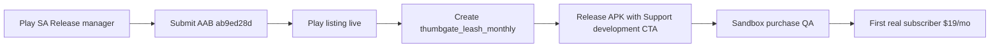

# Hermes Mobile — 7-day revenue sprint (2026-07-05)

## Current state

| Dimension | Status | Evidence |
|-----------|--------|----------|
| **Published on Play / App Store** | **No** — not publicly shippable yet | `store-release.yml` run [28682216964](https://github.com/IgorGanapolsky/mac-yolo-safeguards/actions/runs/28682216964) failed at Play submit: SA missing Release manager |
| **Production AAB ready** | **Yes** — reuse, no new EAS spend | Build `ab9ed28d-9038-40e4-a9c5-864ddb2bc1e1` v0.3.2 vc7 |
| **Revenue today** | **$0/mo** | No live store listing; pipeline DS has no `prospects*.tsv` for 2026-07-05 |
| **Leash Pro IAP in code** | **Wired** | `thumbgate_leash_monthly` via `expo-iap` → `settings.thumbgateProActive` (T-80) |
| **IAP product in stores** | **Unknown / likely missing** | Must exist in Play Console + ASC before first purchase |
| **Upsell surfaces** | **Partial → improved this sprint** | Settings → Gate rules modal + **Support development** section; ThumbGate funnel link on Pro card |
| **EAS credits** | **~exhausted until ~2026-07-22** | Use `eas_build_id` submit-only path; local `npm run android:phone` for dogfood |
| **OpenClaw** | **Free OSS scaffold** | Not a paid SKU — do not bundle |

Package: `com.iganapolsky.hermesmobile` · Product: **Leash Pro** · Price: **$19/mo** · Store SKU: `thumbgate_leash_monthly`

---

## Top 3 money moves (ranked by $/day potential × unblockability this week)

### 1. Play Console: Release manager on CI service account → submit existing AAB

**$/day potential:** Highest — unlocks public discovery + IAP. Even one subscriber ≈ **$19/mo ($0.63/day)**; compounds with installs.

**Unblockability:** **2-minute human step** in Play Console, then fully automated CI submit (zero EAS credits).

**Blocker:** Igor must grant Play permissions (OAuth/UI — agent cannot).

#### Exact 2-minute Console step

1. Open [Play Console → Setup → API access](https://play.google.com/console/developers/api-access) as `iganapolsky@gmail.com` (LLC org).
2. Under **Service accounts**, find `hermes-mobile-publisher@hermes-mobile-play.iam.gserviceaccount.com`.
3. Click **Manage Play Console permissions** (or **Grant access** if missing).
4. **Add app** → **Hermes Mobile** (`com.iganapolsky.hermesmobile`).
5. Check **Release manager** → **Apply**.
6. Wait ~5 minutes, then agent runs submit-only (no new build):

```bash
gh workflow run store-release.yml \
  -f platform=android \
  -f submit=true \
  -f skip_internal_proof=true \
  -f eas_build_id=ab9ed28d-9038-40e4-a9c5-864ddb2bc1e1
```

Detail: [PLAY_RELEASE.md](./PLAY_RELEASE.md)

---

### 2. Create `thumbgate_leash_monthly` subscription in Play + ASC

**$/day potential:** **Required gate** — without store SKU, checkout fails; $0 until this exists.

**Unblockability:** **~15 min human** per store (Play Console + App Store Connect). Code now verifies SKU via `fetchProducts` before opening checkout.

**Setup checklist:**

| Store | Action |
|-------|--------|
| **Google Play** | Monetize → Subscriptions → create **`thumbgate_leash_monthly`**, $19/mo, base plan active |
| **App Store Connect** | Subscriptions → create same product id **`thumbgate_leash_monthly`**, $19.99 tier (or $19 if available) |
| **Sandbox QA** | License tester (Play) / Sandbox Apple ID (ASC) → Settings → Support development → Subscribe |

App shows honest error if SKU missing: *"Subscription thumbgate_leash_monthly is not configured in Google Play Console yet."*

---

### 3. Ship Leash Pro upsell + merge 67-file WIP → production build with paywall telemetry

**$/day potential:** Medium until store live; **critical for conversion** once installs arrive. Funnel: `leash_paywall_view` → `leash_purchase_start` → `leash_purchase_result`.

**Unblockability:** **Fully automatable this week** (no OAuth).

**Implemented in this sprint:**

- Settings → **Support development** — `ProUpgradeCard` + ThumbGate learn-more link (`utm_source=hermes-mobile`) + hardening sprint link
- Settings → **Gate rules** — `LeashProUpsellBanner` for free users (existing)
- `verifyThumbgateLeashProductConfigured()` — `fetchProducts({ skus: ['thumbgate_leash_monthly'], type: 'subs' })` before purchase
- IAP purchase no longer marks `developerLeashUnlock` on real unlock (Gate rules modal)

**Still needed:** Commit + merge WIP to `main`, trigger release build **after** Play SA fix (or submit-only if binary unchanged).

---

## 7-day money plan (ordered)

| Day | Action | Owner | Automated? |
|-----|--------|-------|------------|
| **D0 (today)** | Play SA **Release manager** step above | Igor (2 min) | Submit command after |
| **D0** | Create `thumbgate_leash_monthly` in Play Console | Igor (~10 min) | — |
| **D0** | Submit-only workflow with existing AAB | Agent | `gh workflow run store-release.yml …` |
| **D1** | Complete Play store listing, content rating, data safety if blocking review | Igor | Docs in LAUNCH_CHECKLIST |
| **D1** | ASC subscription + TestFlight submit (`store-release.yml -f platform=ios`) | Igor + Agent | iOS creds in GH secrets |
| **D2** | Sandbox purchase QA on release APK | Agent (`npm run android:phone`) | Maestro optional |
| **D3** | Verify PostHog: `leash_paywall_view`, `leash_purchase_result` | Agent | EAS secret already documented |
| **D4–D5** | Reddit / outbound (blocked — human account) | Igor | Drafts in `business_os/active_leads.md` |
| **D6–D7** | First external user + first paying subscriber proof | Both | KPI dashboard below |

**Do not spend on paid acquisition** until [PROMOTION-PLAYBOOK.md](./PROMOTION-PLAYBOOK.md) spend gates pass (store live + sandbox-proven IAP).

---

## Blockers + who unblocks

| Blocker | Unblocks | ETA |
|---------|----------|-----|
| Play SA lacks **Release manager** on `com.iganapolsky.hermesmobile` | Igor — 2-min Console step (§1 above) | Same day |
| IAP SKU not in Play/ASC | Igor — create `thumbgate_leash_monthly` | Same day |
| 67 uncommitted files / phone at `f60a9be` | Agent — commit + merge when Igor approves | 1 day |
| EAS credits exhausted (~Jul 22) | Wait or submit-only reuse | Now for submit-only |
| Reddit outreach | Human account — not automatable | Out of band |
| OpenClaw paid bundling | **Not planned** — free OSS only | N/A |

---

## KPIs to track

| KPI | Target (7 days) | Source |
|-----|-------------------|--------|
| Play production track live | Yes | Play Console + `store-release.yml` artifact |
| `thumbgate_leash_monthly` store SKU active | Both platforms | `verifyThumbgateLeashProductConfigured()` + Console |
| `leash_paywall_view` / DAU | Baseline after ship | PostHog |
| `leash_purchase_start` → `leash_purchase_result` | >0 sandbox, then >0 prod | PostHog |
| **First paying subscriber** | 1 | Play/ASC revenue reports |
| MRR | **$19** (first sub) | Store dashboards |
| Submit CI green | `store-release.yml` success | GitHub Actions |

---

## Path to first paying subscriber



1. **Human:** Grant Release manager (2 min).
2. **Agent:** Submit-only CI — no EAS rebuild.
3. **Human:** Create subscription SKU in Play (and ASC for iOS).
4. **Agent:** Install release on device, open Settings → Support development → Subscribe.
5. **Verify:** PostHog `leash_purchase_result` status `purchased` + Play order visible.
6. **Scale:** Only after spend gates — thumbgate.ai funnel already linked from app (`THUMBGATE_PRO_URL`).

---

## References

- [LEASH-PRO-MONETIZATION-RESEARCH.md](./LEASH-PRO-MONETIZATION-RESEARCH.md)
- [LAUNCH_CHECKLIST.md](./LAUNCH_CHECKLIST.md)
- [PLAY_RELEASE.md](./PLAY_RELEASE.md)
- [PROMOTION-PLAYBOOK.md](./PROMOTION-PLAYBOOK.md)
- `.github/workflows/store-release.yml`
